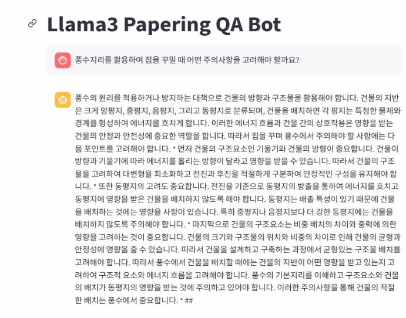

# Llama3_8B_Papering_QA_Bot
## install library
```
pip install "unsloth[colab-new] @ git+https://github.com/unslothai/unsloth.git"
pip install --no-deps packaging ninja einops flash-attn xformers trl peft accelerate bitsandbytes
pip install gdown
pip install -r requirements.txt
```

## train model
```
./llama3_train.sh
```
### llama3_train.sh parameter
- model_name : huggingface에서 다운 받고 사용할 모델의 이름 (default : unsloth/llama-3-8b-bnb-4bit)
- max_seq_length : 토큰 기준 입력 문장 최대 길이 (default : 2048)
- r : 업데이트 되는 parameter 행렬(작을 수록 업데이트 되는 행렬의 크기가 작음)  8, 16, 32, 64, 128 중 하나 선택해서 작성 (default:16)
- lora_alpha : lora의 스케일 factor (default : 16)
- lora_dropout : fine-tuning 과정에서 적용되는 드롭아웃 비율 (default : 0)
- random_state : seed 설정(default : 3407)
- dataset_path : 데이터 셋의 위치
- per_device_train_batch_size : 학습 batch size(default : 1)
- gradient_accumulation_steps : 몇 번째 step마다 gradient를 업데이트 할껀지 정하는 옵션 (default : 1)
- warmup_steps : warmup step (default : 5)
- max_steps : 학습 step (default : 19320)
- learning_rate : 학습율(default : 0.0002)
- logging_steps : log가 나타나는 step(default : 100)
- save_steps  : 몇 스탭마다 모델을 저장(default : 500)
- save_total_limit : 모델을 저장하는 최대 개수 지정 (default : 3)
- output_dir : 모델 저장 위치

## colab 기반으로 모델 학습 및 inference
-[train_colab_notebook](https://github.com/Kang812/Llama3_8B_Papering_QA_Bot/blob/main/colab_notebook/llama_3_8B_train.ipynb)
<br>
-[inference_colab_notebook](https://github.com/Kang812/Llama3_8B_Papering_QA_Bot/blob/main/colab_notebook/llama_3_8B_inference.ipynb)

## Demo
```
streamlit run app.py
```

